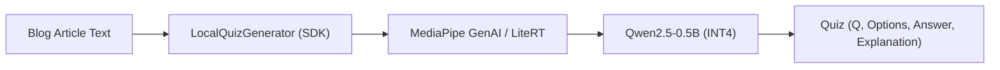

# 🧠 On-Device Blog Quiz Generator (Android SDK & AI Pipeline)

> **블로그 글, 기술 아티클, 개인 메모를 읽고 100% 온디바이스(기기 로컬)에서 실시간 4지선다 퀴즈를 자동 생성하는 AI 라이브러리 및 SDK**

[](https://jitpack.io/#kez-lab/ondevice-blog-quiz-generator)
[](https://opensource.org/licenses/Apache-2.0)
[](https://huggingface.co/kez-lab/qwen2.5-0.5b-blog-quiz-android)
[](https://developer.android.com)

---

## 🌟 Key Highlights

1. **🔒 100% Zero Server Cost & Privacy**: 
   - 사용자가 읽고 있는 글이나 개인 메모를 외부 서버로 전혀 전송하지 않고, 스마트폰 NPU/GPU/CPU에서 직접 추론합니다.
2. **⚡ Ultra Fast & Lightweight (Qwen2.5-0.5B)**:
   - 4-bit 양자화 기준 **~350MB**로 보급형 스마트폰에서도 메모리 부족 없이 초고속 추론 지원.
3. **📦 Clean Structured Output (JSON)**:
   - 질문(Question), 4지선다 보기(Options), 정답 번호(Answer Index), 상세 해설(Explanation)을 바로 사용할 수 있는 Kotlin `Quiz` 데이터 클래스로 파싱.
4. **🎨 Interactive Demo App Included**:
   - Jetpack Compose 기반의 실시간 퀴즈 풀기 및 채점 인터랙션 UI 제공.

---

## 🏗️ Architecture



---

## 📥 Android SDK Quickstart

### 1. JitPack 저장소 추가

`settings.gradle.kts`에 JitPack 레포지토리를 추가합니다:

```kotlin
dependencyResolutionManagement {
    repositories {
        google()
        mavenCentral()
        maven { url = java.net.URI("https://jitpack.io") }
    }
}
```

### 2. 의존성 추가 (`build.gradle.kts`)

```kotlin
dependencies {
    implementation("com.github.kez-lab:ondevice-blog-quiz-generator:1.0.0")
}
```

---

## 💻 Code Examples

### 1. 기본 생성 (단일 호출)

```kotlin
val quizGen = LocalQuizGenerator.builder(context)
    .fromHuggingFace("your-hf-username/qwen2.5-0.5b-blog-quiz-android")
    .build()

// 블로그 글을 넣으면 퀴즈 목록 반환
val result = quizGen.generateQuiz(blogArticleText, count = 2)

result.onSuccess { quizzes ->
    quizzes.forEach { quiz ->
        println("Q: ${quiz.question}")
        println("보기: ${quiz.options}")
        println("정답: ${quiz.correctAnswer}")
        println("해설: ${quiz.explanation}")
    }
}.onFailure { error ->
    println("에러 발생: ${error.message}")
}
```

### 2. 실시간 스트리밍 UI 연동 (`Flow`)

```kotlin
lifecycleScope.launch {
    quizGen.generateQuizStream(blogArticleText, count = 2).collect { state ->
        when (state) {
            is QuizGenerationState.DownloadingModel -> {
                progressBar.progress = state.progressPercent
            }
            is QuizGenerationState.LoadingModel -> {
                statusText.text = "온디바이스 AI 엔진 로딩 중..."
            }
            is QuizGenerationState.Generating -> {
                // 실시간 생성 토큰 출력
                rawTokenView.text = state.rawTokens
            }
            is QuizGenerationState.Success -> {
                // 퀴즈 카드 UI 바인딩
                renderQuizCards(state.quizzes)
            }
            is QuizGenerationState.Error -> {
                showToast(state.message)
            }
            else -> Unit
        }
    }
}
```

---

## 🐍 Python AI 파이프라인 (학습 & 허깅페이스 배포)

이 프로젝트는 나만의 데이터셋으로 파인튜닝하고 허깅페이스 Hub에 배포할 수 있는 풀 패키지 스크립트를 제공합니다.

```bash
# 1. 의존성 설치
pip install -r scripts/requirements.txt

# 2. 퀴즈 생성 데이터셋 준비
python scripts/generate_dataset.py

# 3. M4 Pro / Mac MPS 가속 LoRA 파인튜닝
python scripts/train_lora.py

# 4. 로컬 추론 테스트
python scripts/test_inference.py

# 5. Hugging Face Hub에 내 이름으로 업로드
python scripts/upload_to_hf.py --repo-id "your-username/qwen2.5-0.5b-blog-quiz-android"
```

---

## 📱 Sample Demo App

`:app` 모듈에는 Jetpack Compose 기반으로 작성된 완성형 데모 앱이 포함되어 있습니다.
- 샘플 기술 블로그 글 선택 (코루틴, 온디바이스 AI, 컴포즈)
- 실시간 퀴즈 생성 진행 표시
- 4지선다 보기 클릭 시 즉시 정답/오답 애니메이션 피드백 및 정답 해설 펼침 효과

---

## 📖 On-Device AI & sLLM Fine-Tuning Handbook (`docs/`)

입문자부터 실무자까지 참고할 수 있는 9개 챕터의 상세 기술 문서가 [`docs/`](docs/) 폴더에 제공됩니다.

| 파트 | 챕터 | 핵심 내용 |
| :--- | :--- | :--- |
| **🟢 Phase 1. 기초 개념 & 멘탈 모델** | [01. AI & 온디바이스 기초](docs/01_ai_fundamentals_for_beginners.md) | 파라미터(0.5B), 가중치, 양자화(INT4) 8배 압축 원리 |
| | [02. AI 글 이해 원리](docs/02_how_llms_actually_work.md) | 토큰(Token), 임베딩(Vector), 어텐션(Attention), Next Token 예측 |
| | [03. 생성 파라미터 정복](docs/03_generation_parameters_mastery.md) | Temperature, Top-P, Top-K, Repetition Penalty 치트시트 |
| | [04. AI 엔지니어 성장 로드맵](docs/04_ai_engineer_growth_roadmap.md) | 전통 코딩 vs AI 확률 모델, 4대 기술 트리(Prompt ➡️ RAG ➡️ LoRA ➡️ Edge) |
| **🟡 Phase 2. MLOps & 파인튜닝** | [05. 파인튜닝과 LoRA](docs/05_fine_tuning_and_lora_explained.md) | LoRA 저순위 분해, Rank($r$), Alpha($\alpha$), Loss 마스킹 |
| | [06. 데이터 엔지니어링](docs/06_data_engineering_and_synthetic_data.md) | `.jsonl` 구조, 3가지 합성 데이터 기법, 킬러 오답 설계 |
| | [07. Mac AI 학습 실무 가이드](docs/07_mac_apple_silicon_ai_training_guide.md) | Apple Silicon 통합 메모리(48GB) & Metal MPS 가속 |
| | [08. 실전 파인튜닝 8단계 플레이북](docs/08_step_by_step_finetuning_playbook.md) | 기획 ➡️ 데이터 ➡️ LoRA ➡️ 평가 ➡️ 양자화 ➡️ 배포 |
| | [09. 허깅페이스 완벽 가이드](docs/09_huggingface_complete_guide.md) | Hub 구조(Models/Datasets), Model Card 작성법, `hf` CLI |
| **🔵 Phase 3. 모바일 & FAQ** | [10. 온디바이스 모델 종류 & 선정](docs/10_ondevice_model_landscape_and_selection.md) | sLLM/VLM 라인업, 스마트폰 RAM별 모델 선정 공식 |
| | [11. 안드로이드 SDK 배포](docs/11_android_ondevice_ai_sdk_architecture.md) | MediaPipe GenAI, Kotlin Flow 스트리밍, JitPack 배포 |
| | [12. FAQ & 트러블슈팅](docs/12_faq_and_troubleshooting.md) | 발열/Loss 수렴 실패 대처법, JSON 3중 방어 파서 |

---

## 📄 License
Apache License 2.0
