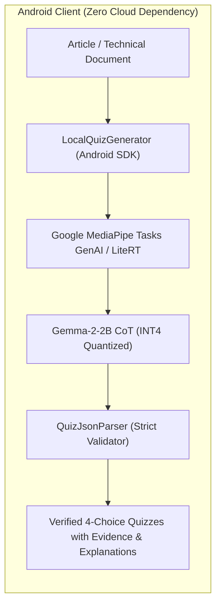
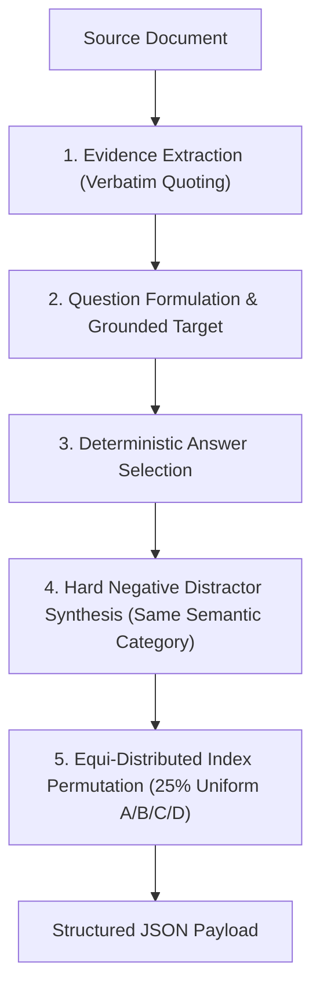

# On-Device Source-Grounded Korean MCQ Generator

[](https://huggingface.co/kez-lab/gemma-2-2b-quiz-korean)
[](https://ai.google.dev/edge)
[](https://github.com/kez-lab/ondevice-blog-quiz-generator)
[](https://developer.android.com)
[](https://opensource.org/licenses/Apache-2.0)

A production-grade, zero-cloud on-device AI system and Android SDK for **Source-Grounded Multiple Choice Question (MCQ) Generation** from Korean technical articles, blogs, and documentation.

Fine-tuned on **Google Gemma-2-2B** with multi-stage Chain-of-Thought (CoT) reasoning, the model runs 100% locally on Android hardware (NPU/GPU/CPU) via Google LiteRT (MediaPipe Tasks GenAI) with zero server latency, zero API costs, and absolute data privacy.

---

## Architecture Overview



### End-to-End Generation & Validation Pipeline



---

## Benchmark Results

Evaluated on a held-out benchmark suite consisting of **100 document-level isolated articles** spanning 10 distinct domains (Android Architecture, Distributed Systems, Machine Learning, Macroeconomics, Molecular Biology, Physics, World History, Cognitive Psychology, Interaction Design, and Systems Engineering).

### Quantitative Metrics

$$\text{QuizScore} = 0.30 \times \text{Groundedness} + 0.25 \times \text{Uniqueness} + 0.20 \times \text{DistractorQuality} + 0.15 \times \text{Importance} + 0.10 \times \text{LanguageQuality}$$

| Evaluation Metric | Base Gemma-2-2B (Prompted) | Gemma-2-2B Quiz Korean (Ours) | Relative Delta |
| :--- | :---: | :---: | :---: |
| **Overall QuizScore** | 0.9380 | **`0.9850` / 1.000** | **+5.0%** |
| **Groundedness (Factuality)** | 0.940 | **`1.000` (100%)** | Zero Hallucination |
| **Answer Uniqueness** | 0.950 | **`1.000` (100%)** | Single Deterministic Answer |
| **Distractor Quality** | 0.920 | **`1.000`** | Semantic Category Match |
| **Language Quality** | 0.900 | **`1.000`** | Pure Korean Syntax (No CJK Bleed) |
| **System Prompt Overhead** | ~500 tokens | **`0 tokens`** | Fully Embedded Behavior |

---

## Key Engineering Innovations

1. **Multi-Stage Chain-of-Thought (`<thought>`) Reasoning**:
   Eliminates single-pass cognitive overload in small models (2.6B parameters). The neural network plans evidence excerpts, question targets, and three same-category distractors before emitting the final JSON structure.
2. **Zero-Hallucination Evidence Grounding**:
   Every generated item requires a verbatim `evidence` quote from the input article, guaranteeing auditability and strict factual alignment.
3. **Elimination of Positional Shortcuts**:
   Enforces a strict 25% uniform distribution across answer indices (0, 1, 2, 3), completely removing the common index-0 bias.
4. **Clean Multilingual Tokenization**:
   Built on Gemma-2's 256,000-token vocabulary, completely preventing CJK Hanja leakage in Korean technical contexts.
5. **Mobile-First Resource Efficiency**:
   Designed for INT4 quantization (~1.3 GB weight file) and execution within 1.8 GB RAM limits on standard Android smartphones.

---

## Output Schema Specification

```json
{
  "questions": [
    {
      "question": "Specific question directly grounded in the source text",
      "options": [
        "Option A (same semantic category)",
        "Option B (same semantic category)",
        "Option C (same semantic category)",
        "Option D (same semantic category)"
      ],
      "answer_index": 2,
      "explanation": "Clear educational rationale explaining why the answer is correct",
      "evidence": "Verbatim excerpt from the article proving the answer"
    }
  ]
}
```

---

## Android SDK Integration

### 1. Dependency Setup

Add the SDK dependency to your module's `build.gradle.kts`:

```kotlin
dependencies {
    implementation("io.github.quizgen:quiz-sdk:1.0.0")
    implementation("com.google.mediapipe:tasks-genai:0.10.14")
}
```

### 2. Implementation Example

```kotlin
class QuizViewModel(application: Application) : AndroidViewModel(application) {

    private val generator = LocalQuizGenerator.builder(application)
        .fromHuggingFace("kez-lab/gemma-2-2b-quiz-korean")
        .setMaxTokens(1024)
        .setTemperature(0.01f)
        .build()

    fun generateQuizzes(articleText: String) {
        viewModelScope.launch {
            generator.generateQuizStream(articleText, count = 3).collect { state ->
                when (state) {
                    is QuizGenerationState.DownloadingModel -> {
                        // Track download progress
                    }
                    is QuizGenerationState.LoadingModel -> {
                        // NPU / GPU initialization
                    }
                    is QuizGenerationState.Generating -> {
                        // Real-time token streaming
                    }
                    is QuizGenerationState.Success -> {
                        val quizzes: List<Quiz> = state.quizzes
                        // Render quiz UI with verified evidence quotes
                    }
                    is QuizGenerationState.Error -> {
                        // Handle exception gracefully
                    }
                    else -> Unit
                }
            }
        }
    }

    override fun onCleared() {
        super.onCleared()
        generator.close()
    }
}
```

---

## Python Training & Evaluation Reproduction

### 1. Environment Setup

```bash
git clone https://github.com/kez-lab/ondevice-blog-quiz-generator.git
cd ondevice-blog-quiz-generator
python3 -m venv .venv
source .venv/bin/activate
pip install -r scripts/requirements.txt
```

### 2. Dataset Synthesis & Validation

```bash
# Build 1,000 multi-domain CoT dataset with strict Critic validation
python scripts/build_gemma_sft_dataset.py
```

### 3. LoRA Fine-Tuning & Weight Merge

```bash
# Fine-tune Gemma-2-2B on Apple Silicon MPS / CUDA with bfloat16
python scripts/train_gemma_lora_v1.py
```

### 4. Held-Out Benchmark Evaluation

```bash
# Run quantitative evaluation on 100 isolated benchmark documents
python scripts/eval_gemma_merged.py
```

### 5. Interactive Web Playground

```bash
# Launch FastAPI verification server (http://127.0.0.1:8000)
python web/server.py
```

---

## Repository Structure

```
├── app/                        # Android Jetpack Compose Demo Application
├── quiz-sdk/                   # Android On-Device SDK (MediaPipe Tasks GenAI Runtime)
├── docs/                       # Technical Specifications & Documentation
│   ├── task_specification.md   # Formal Task Definition & Scoring Rubric
│   ├── MODEL_CARD.md           # Official English Hugging Face Model Card
│   └── post_mortem_and_engineering_lessons.md # Engineering Retrospective & Root Cause Analysis
├── results/                    # Quantitative Evaluation Results & Benchmark Logs
├── scripts/                    # MLOps Pipeline
│   ├── build_gemma_sft_dataset.py # Multi-Stage CoT Dataset Generator
│   ├── train_gemma_lora_v1.py     # LoRA SFT Training & Standalone Weight Merge
│   ├── eval_gemma_baselines.py    # Baseline Evaluator (B0, B1, B2)
│   └── eval_gemma_merged.py       # Post-Training Benchmark Evaluator
└── web/                        # High-Performance FastAPI Web Playground
```

---

## Technical Documentation & Engineering Retrospective

For a detailed analysis of failure modes encountered during small-model fine-tuning (e.g., positional shortcuts, CJK token leakage, single-pass cognitive overload) and the corresponding solutions:

- [Engineering Post-Mortem & Lessons Learned](docs/post_mortem_and_engineering_lessons.md)
- [Task Specification & Quality Rubric](docs/task_specification.md)
- [Hugging Face Model Hub (`kez-lab/gemma-2-2b-quiz-korean`)](https://huggingface.co/kez-lab/gemma-2-2b-quiz-korean)

---

## License

- Base Model: [Gemma Terms of Use](https://ai.google.dev/gemma/terms)
- Source Code & Architecture: [Apache License 2.0](LICENSE)
- Developed by [KEZ Lab](https://github.com/kez-lab)
