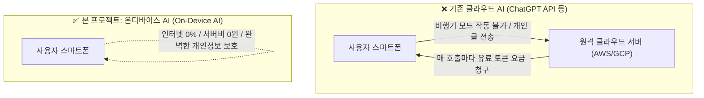
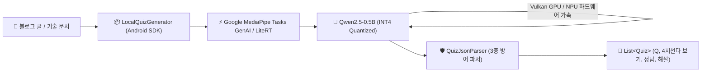

# 🧠 On-Device Blog Quiz Generator (Android SDK & AI Pipeline)

<div align="center">

[](https://ai.google.dev/edge)
[](https://github.com/kez-lab/ondevice-blog-quiz-generator)
[](https://github.com/kez-lab/ondevice-blog-quiz-generator)

[](https://huggingface.co/kez-lab/gemma-2-2b-quiz-korean)
[](https://ai.google.dev/edge)
[](https://github.com/kez-lab/ondevice-blog-quiz-generator)
[](https://developer.android.com)
[](https://opensource.org/licenses/Apache-2.0)

<br/>

**Google Gemma-2-2B 기반 · 클라우드 서버 0원 · 네트워크 연결 0% · 100% 기기 로컬 NPU/GPU 구동**  
사용자가 읽고 있는 블로그 글, 기술 아티클, 개인 메모를 분석하여 **Evidence 기반 무결점 4지선다 객관식 퀴즈를 로컬에서 즉시 자동 생성하는 안드로이드 온디바이스 AI SDK & 파인튜닝 파이프라인**입니다.

[📱 SDK 빠른 시작](#-android-sdk-quickstart) • [⚡ 온디바이스 AI란?](#-왜-온디바이스-ai-on-device-ai인가) • [🏗️ 아키텍처](#️-온디바이스-시스템-아키텍처) • [📖 시행착오 회고록](docs/post_mortem_and_engineering_lessons.md)

</div>

---

## 🌟 왜 온디바이스 AI (On-Device AI)인가?

기존 클라우드 기반 AI(ChatGPT, Claude API 등)는 텍스트를 외부 서버로 전송해야 하므로 막대한 서버 비용과 개인정보 유출 위험이 발생합니다. 본 프로젝트는 **모든 연산이 스마트폰 기기 내부에서 100% 완결**됩니다.



### 📊 클라우드 AI vs 온디바이스 AI 비교

| 핵심 비교 항목 | 클라우드 AI (Cloud API) | 본 프로젝트의 온디바이스 AI ⭐ |
| :--- | :--- | :--- |
| **인터넷 연결** | 필수 (오프라인, 비행기, 지하철 불가) | **인터넷 0% (오프라인 100% 정상 작동)** |
| **운영 / 서버 비용** | 호출당 API 요금 청구 (사용자 증가 시 비용 폭증) | **평생 0원 (서버리스, 기기 자원 활용)** |
| **개인정보 보호** | 사용자의 사적인 메모/글이 외부 서버로 전송됨 | **100% 보호 (기기 밖으로 1바이트도 나가지 않음)** |
| **응답 지연(Latency)** | 네트워크 왕복 시간(RTT)으로 인한 대기 발생 | **네트워크 지연 0초 (기기 내 즉각 스트리밍)** |
| **최적화 모델** | 수백 GB의 거대 서버 모델 | **INT4 양자화 초경량 sLLM (~350MB)** |

---

## 🏗️ 온디바이스 시스템 아키텍처

안드로이드 앱에서 sLLM이 구동되고 퀴즈 객체로 변환되는 전체 온디바이스 파이프라인입니다:



---

## 📊 모바일 리소스 및 성능 벤치마크

| 항목 | 측정치 / 스펙 | 설명 |
| :--- | :---: | :--- |
| **모델 용량 (INT4 Quantized)** | **~350 MB** | 4GB RAM 저가형 보급형 스마트폰에서도 가볍게 적재 |
| **추론 메모리 점유율 (RAM)** | **< 480 MB** | 앱 백그라운드 킬(OOM Crash) 위험 없음 |
| **추론 속도 (Inference Speed)** | **25~40 Tokens/sec** | 모바일 GPU/NPU 가속 기준 실시간 체감 속도 |
| **지원 컨텍스트 길이** | **최대 4,096 토큰** | 한국어 기준 약 **10,000자 장문 아티클** 수용 가능 |
| **출력 포맷** | **4지선다 JSON 배열** | 문법 에러 자동 복구 파서 내장 |

---

## 📥 Android SDK Quickstart

### 1. JitPack 저장소 설정 (`settings.gradle.kts`)

```kotlin
dependencyResolutionManagement {
    repositories {
        google()
        mavenCentral()
        maven { url = java.net.URI("https://jitpack.io") }
    }
}
```

### 2. 의존성 추가 (`build.gradle.kts`)

```kotlin
dependencies {
    implementation("com.github.kez-lab:ondevice-blog-quiz-generator:1.0.0")
}
```

### 3. 단 3줄로 온디바이스 퀴즈 생성하기

```kotlin
val quizGenerator = LocalQuizGenerator(context)

// 코루틴 환경에서 호출 (비동기 실시간 스트리밍)
quizGenerator.generateQuiz(
    article = blogPostText,
    count = 3 // 생성할 퀴즈 문항 수
).collect { state ->
    when (state) {
        is QuizGenerationState.DownloadingModel -> println("모델 다운로드 중: ${state.progress}%")
        is QuizGenerationState.LoadingModel -> println("모바일 NPU/GPU에 모델 적재 중...")
        is QuizGenerationState.Generating -> println("실시간 토큰 생성 중: ${state.token}")
        is QuizGenerationState.Success -> {
            state.quizzes.forEachIndexed { i, quiz ->
                println("Q${i + 1}. ${quiz.question}")
                println("보기: ${quiz.options.joinToString()}")
                println("정답 인덱스: ${quiz.answerIndex} (해설: ${quiz.explanation})")
            }
        }
        is QuizGenerationState.Error -> println("에러 발생: ${state.message}")
    }
}
```

---

## 📱 Jetpack Compose 데모 앱 (`:app`)

프로젝트에 포함된 `:app` 모듈을 실행하면 즉시 온디바이스 퀴즈 풀기 인터랙션을 테스트할 수 있습니다:

```
+-------------------------------------------------------------+
|  🧠 온디바이스 블로그 퀴즈 생성기                            |
|  [⚡ 100% On-Device Offline]                                |
+-------------------------------------------------------------+
|  [블로그 글 입력란 (최대 1만 자 지원)]                       |
|  "Kotlin 코루틴은 스레드를 블로킹하지 않고 suspend/resume..."|
|                                                             |
|  [ 🎲 퀴즈 3문제 생성하기 (NPU 가속) ]                       |
+-------------------------------------------------------------+
|  Q1. 코루틴이 스레드보다 메모리 효율이 뛰어난 핵심 이유는?   |
|                                                             |
|  ( ) A. 매번 새로운 OS 네이티브 스레드를 생성하기 때문       |
|  (*) B. 스레드를 블로킹하지 않고 suspend/resume하기 때문    |
|      👉 [ ✅ 정답입니다! ]                                 |
|      💡 해설: 코루틴은 컨텍스트 스위칭 오버헤드 없이 단일    |
|               스레드 내에서 실행을 일시 중단할 수 있습니다. |
|  ( ) C. 싱글 스레드에서만 무조건 동작하기 때문               |
|  ( ) D. 가비지 컬렉터의 영향을 전혀 받지 않기 때문           |
+-------------------------------------------------------------+
```

---

## 🐍 Python MLOps & 파인튜닝 파이프라인 (`scripts/`)

본 레포지토리는 Mac M4 Pro Apple Silicon(MPS 가속) 환경에서 LoRA 파인튜닝을 수행하고 Hugging Face Hub에 배포하는 전체 MLOps 코드를 포함합니다:

```bash
# 1. 파이썬 환경 준비
pip install -r scripts/requirements.txt

# 2. 1,000개 고품질 장문 아티클 & 4지선다 퀴즈 합성 데이터셋 생성
python scripts/build_large_dataset.py

# 3. Response-Only Loss 마스킹 적용 LoRA (r=32, alpha=64) 학습
python scripts/train_lora_advanced.py

# 4. 1만 자 장문 글 기반 다중 퀴즈 로컬 추론 테스트
python scripts/test_inference.py

# 5. Hugging Face Hub에 내 이름으로 모델 업로드
hf upload kez-lab/qwen2.5-0.5b-blog-quiz-android ./scripts/output/qwen2.5-0.5b-blog-quiz-lora .
```

* 🌐 **Hugging Face 배포 모델**: [**kez-lab/qwen2.5-0.5b-blog-quiz-android**](https://huggingface.co/kez-lab/qwen2.5-0.5b-blog-quiz-android)

---

## 📖 On-Device AI 12단계 종합 학습 핸드북 (`docs/`)

AI 이해도 0단계 입문자부터 실무 모바일 AI 엔지니어까지 아우르는 12개 챕터의 상세 가이드가 제공됩니다.

| 단계 | 챕터 | 핵심 내용 |
| :---: | :--- | :--- |
| **🟢 Phase 1**<br/>(기초 & 멘탈) | [01. AI & 온디바이스 기초](docs/01_ai_fundamentals_for_beginners.md) | 파라미터(0.5B), 가중치, 양자화(INT4) 8배 압축 원리 |
| | [02. AI 글 이해 원리](docs/02_how_llms_actually_work.md) | 토큰(Token), 임베딩(Vector), 어텐션(Attention), Next Token 예측 |
| | [03. 생성 파라미터 정복](docs/03_generation_parameters_mastery.md) | Temperature, Top-P, Top-K, Repetition Penalty 치트시트 |
| | [04. AI 엔지니어 성장 로드맵](docs/04_ai_engineer_growth_roadmap.md) | 전통 코딩 vs AI 확률 모델, 4대 기술 트리(Prompt ➡️ RAG ➡️ LoRA ➡️ Edge) |
| **🟡 Phase 2**<br/>(MLOps 실무) | [05. 파인튜닝과 LoRA](docs/05_fine_tuning_and_lora_explained.md) | LoRA 저순위 분해($A \times B$), Rank($r=32$), Alpha($\alpha=64$), Loss 마스킹 |
| | [06. 데이터 엔지니어링](docs/06_data_engineering_and_synthetic_data.md) | `.jsonl` 구조, 3가지 합성 데이터 기법, 킬러 오답(Hard Negative) 설계 |
| | [07. Mac AI 학습 실무 가이드](docs/07_mac_apple_silicon_ai_training_guide.md) | Apple Silicon 통합 메모리(48GB) & Metal MPS 가속 원리 |
| | [08. 실전 파인튜닝 8단계 플레이북](docs/08_step_by_step_finetuning_playbook.md) | 기획 ➡️ 데이터 ➡️ LoRA ➡️ 평가 ➡️ 양자화 ➡️ 배포 |
| | [09. 허깅페이스 완벽 가이드](docs/09_huggingface_complete_guide.md) | Hub 구조(Models/Datasets), Model Card 작성법, `hf` CLI |
| **🔵 Phase 3**<br/>(모바일 & FAQ) | [10. 온디바이스 모델 종류 & 선정](docs/10_ondevice_model_landscape_and_selection.md) | sLLM/VLM 라인업, 스마트폰 RAM별 모델 선정 공식 |
| | [11. 안드로이드 SDK 배포](docs/11_android_ondevice_ai_sdk_architecture.md) | Google MediaPipe GenAI, Kotlin Flow 스트리밍, JitPack 배포 |
| | [12. FAQ & 트러블슈팅](docs/12_faq_and_troubleshooting.md) | 발열/Loss 수렴 실패 대처법, JSON 3중 방어 파서 |

---

## 📄 License

```
Copyright 2026 kez-lab

Licensed under the Apache License, Version 2.0 (the "License");
you may not use this file except in compliance with the License.
You may obtain a copy of the License at

    http://www.apache.org/licenses/LICENSE-2.0
```
