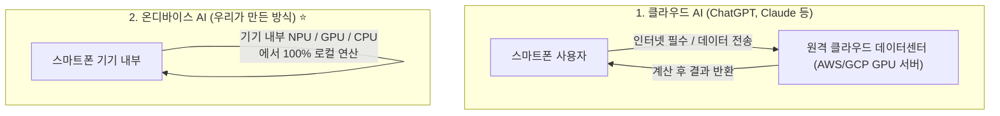
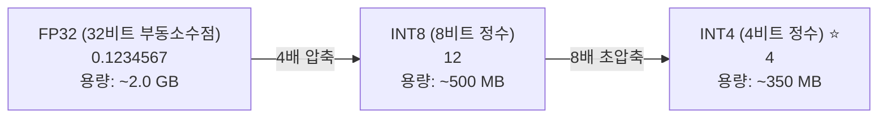

# 📚 [01] 완전 초보자를 위한 AI & 온디바이스 기초 개념

AI 모델, 파인튜닝, 온디바이스 개발을 처음 시작하는 분들을 위해 가장 기초적인 용어부터 쉬운 비유와 다이어그램으로 완벽하게 정리한 첫 번째 가이드입니다.

---

## 1. AI와 언어 모델의 핵심 기본 용어

### ① 파라미터(Parameter)와 'B'의 의미
* **파라미터**: AI 모델의 **"뇌세포"** 또는 **"지식의 조절 나사"**라고 생각하면 됩니다.
* **0.5B, 2B, 7B에서 'B'란?**: **Billion (10억)**을 뜻합니다.
  * **0.5B (Qwen2.5-0.5B)** = 약 **5억 개**의 파라미터 ➡️ 스마트폰/스마트워치에 최적화된 초경량 모델
  * **1.5B (Qwen2.5-1.5B)** = 약 **15억 개**의 파라미터 ➡️ 중급 스마트폰에 적합한 가성비 모델
  * **2B (Gemma-2-2B)** = 약 **20억 개**의 파라미터 ➡️ 구글 공식 온디바이스 표준 모델
  * **7B / 8B (Llama-3-8B)** = 약 **70~80억 개**의 파라미터 ➡️ 고성능 PC / 서버 전용
  * **70B / 405B (Llama-3-70B)** = 초대형 데이터센터 서버 클러스터 전용

> 💡 **비유**: 파라미터 수가 많을수록 시험 공부를 많이 한 고학력자이지만 뇌가 무겁고 밥(메모리/배터리)을 많이 먹습니다. 반면 0.5B 모델은 가벼운 백과사전으로, 특정 업무(퀴즈 만들기, 3줄 요약)만 집중 훈련시키면 7B 못지않게 똑똑하게 동작합니다.

### ② 가중치(Weight)란?
* AI 모델 파일(`.safetensors` 또는 `.bin`)을 열어보면 사실 수억 개의 **"소수점 숫자들"**로 가득 차 있습니다.
* 글자를 입력받았을 때 어떤 단어를 다음에 내보낼지 계산하는 **"수식 속의 계수(숫자)"**를 가중치라고 부릅니다.
* **학습(Training)이란?**: 이 수억 개의 가중치 숫자들을 정답에 맞게 조금씩 다듬는 과정입니다.

---

## 2. 온디바이스 AI(On-Device AI) vs 클라우드 AI

| 비교 항목 | 클라우드 AI (Cloud AI) | 온디바이스 AI (On-Device AI) ⭐ |
| :--- | :--- | :--- |
| **실행 위치** | 원격 데이터센터 서버 (AWS, Azure 등) | **스마트폰/태블릿 기기 내부** |
| **인터넷 연결** | 필수 (오프라인 시 먹통) | **인터넷 0% (비행기, 지하철, 산속 가능)** |
| **서버/API 비용** | 호출할 때마다 토큰 비용 발생 (비쌈) | **평생 무료 (서버 비용 0원)** |
| **개인정보 보호** | 사적인 글이나 메모가 외부 서버로 전송됨 | **100% 안전 (기기 밖으로 1바이트도 안 나감)** |
| **반응 속도** | 네트워크 통신 왕복 지연(Latency) 발생 | **네트워크 지연 없음 (즉각 반응)** |
| **핵심 과제** | 서버 유지비, 트래픽 폭증 관리 | **스마트폰 RAM/배터리 절약 (경량화 필수)** |

---

## 3. 양자화(Quantization)란 무엇인가?

스마트폰의 메모리(RAM)는 컴퓨터보다 훨씬 작습니다. 따라서 **모델의 크기를 4~8배 압축하는 "양자화"** 기술이 필수적입니다.

* **FP32 (32비트 부동소수점)**: 소수점 7자리까지 정밀하게 저장 ➡️ 모델 용량 약 2GB (스마트폰에 부담)
* **INT8 (8비트 정수)**: 1바이트 정수로 변환 ➡️ 모델 용량 약 500MB (4배 압축)
* **INT4 (4비트 정수)**: 0.5바이트로 초압축 ➡️ 모델 용량 약 **350MB (8배 압축)**

> 💡 **비유**: 4K 초고화질 영화를 스마트폰 화면 크기에 맞게 가벼운 FHD/HD로 리사이징해도 사람이 보기에는 화질 차이가 거의 없는 것처럼, 모델 가중치를 INT4로 줄여도 퀴즈 생성 같은 특정 작업 성능은 98% 이상 그대로 유지됩니다!
