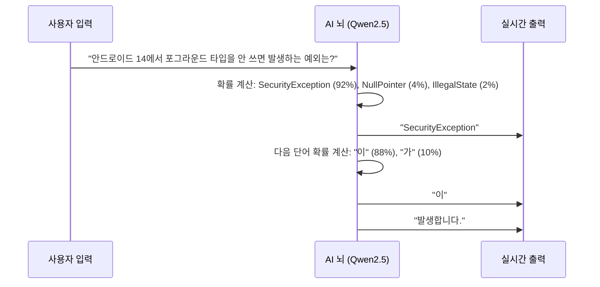

# 🧩 [02] AI는 어떻게 글을 이해하고 말할까? (토큰, 임베딩, 어텐션)

컴퓨터가 한글/영어를 숫자로 바꾸고, 단어 사이의 관계를 파악하여, 다음 문장을 실시간으로 생성하는 **거대 언어 모델(LLM)의 핵심 내부 작동 원리**를 알기 쉽게 설명합니다.

---

## 1. AI는 글자를 읽지 못합니다 (토큰과 토크나이저)

컴퓨터는 `0`과 `1`밖에 모르는 계산기입니다. 따라서 텍스트를 AI에게 전달하려면 **"숫자 번호표(Token ID)"**로 잘게 쪼개야 합니다. 이 변환기를 **토크나이저(Tokenizer)**라고 부릅니다.

```mermaid
flowchart LR
    A["'코루틴은 빠르다' (문자열)"] -->|토크나이저 (Tokenizer)| B["[10823, 4521, 992] (토큰 ID 번호표)"]
    B -->|신경망 연산| C["[10823, 4521, 992, 1204] (다음 토큰 예측)"]
    C -->|디토크나이저 (Detokenizer)| D["'코루틴은 빠르고 가볍다' (출력 텍스트)"]
```

* **토큰(Token)**: AI가 글자를 읽는 최소 단위 (단어, 형태소, 또는 글자 조각)
* **어휘 사전(Vocabulary)**: 모델이 알고 있는 토큰들의 총 목록 (보통 3만 ~ 15만 개)
* **주의점**: 한국어는 어휘 사전이 부실한 영미권 모델(Llama 2 등)에서는 1글자가 3~5개 토큰으로 쪼개져 속도가 느려집니다. 우리가 선택한 **Qwen2.5**는 한국어 어휘가 풍부하여 한국어 처리 속도가 매우 빠릅니다.

---

## 2. 단어에 의미와 위치를 부여하는 "임베딩(Embedding Vector)"

단순히 숫자 번호표만 주면 AI는 `사과(100)`와 `바나나(101)`가 과일이라는 의미적 유사성을 알 수 없습니다. 그래서 단어를 **수천 차원의 공간 속 좌표(Vector)**로 변환합니다.

```
사과   = [0.82, 0.15, -0.45, 0.91, ...]
바나나 = [0.79, 0.18, -0.42, 0.88, ...] ➡️ (사과와 좌표 거리가 매우 가까움!)
자동차 = [-0.62, 0.88, 0.95, -0.12, ...] ➡️ (과일들과 좌표 거리가 매우 멂!)
```

> 💡 **비유**: 3차원 지도에서 '서울'과 '인천'은 가깝고 '런던'은 먼 것처럼, AI의 머릿속 의미 지도(고차원 벡터 공간)에서 비슷한 뜻을 가진 단어들은 서로 가까이 뭉쳐 있습니다.

---

## 3. 문맥을 이해하는 마법 "어텐션(Self-Attention)"

단어는 문맥에 따라 뜻이 완전히 바뀝니다:
* 문장 1: *"어제 밤에 먹은 달콤한 **배**가 맛있었다."* ➡️ (과일 배 🍐)
* 문장 2: *"부산항에서 출발한 대형 **배**가 바다를 건넜다."* ➡️ (바다 배 🚢)

AI는 **어텐션(Attention)** 메커니즘을 통해 문장 안의 다른 단어들과의 연결 고리(가중치)를 계산합니다:
* 문장 1에서는 "먹은", "달콤한", "맛있었다"에 높은 어텐션 점수를 줌 ➡️ "아, 이 **배**는 과일이구나!"
* 문장 2에서는 "부산항", "대형", "바다"에 높은 어텐션 점수를 줌 ➡️ "아, 이 **배**는 타는 배구나!"

---

## 4. LLM의 본질: "다음에 올 가장 그럴듯한 토큰 맞추기 게임"

거대 언어 모델(LLM)이 아무리 똑똑해 보여도 본질은 단 하나입니다:

> **"지금까지 주어진 문맥을 보고, 다음에 올 확률이 가장 높은 단어(토큰)를 하나씩 계속 이어 붙이기 (Next Token Prediction)"**



이 확률 계산과 단어 붙이기를 1초에 30~50번 반복하면서 완전한 JSON 퀴즈 문장이 만들어집니다!
