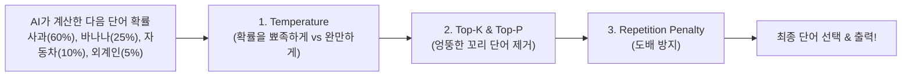

# 🎛️ [03] Temperature, Top-P, Top-K 완벽 정복 (AI의 뇌를 조절하는 레버들)

AI 모델을 호출하거나 안드로이드 SDK를 개발할 때 항상 설정해야 하는 **핵심 추론 파라미터들의 직관적인 의미와 최적의 세팅값 가이드**입니다.

---

## 1. 생성 파라미터 4대장 한눈에 보기

AI가 다음 단어를 고를 때, 확률 통계 분포를 어떻게 다듬어서 최종 단어를 뽑을지 결정하는 필터들입니다:

---

## 2. 각 파라미터의 상세 원리와 쉬운 비유

### ① Temperature (온도: `0.0 ~ 1.0`)
* **의미**: AI의 **"창의성 vs 논리성"** 조절 레버입니다.
* **낮은 온도 (`0.1 ~ 0.3`)**: 1등 확률을 가진 단어에 확률을 몰아줍니다. (얼음처럼 차갑고 단단함)
  * ➡️ **용도**: **JSON 퀴즈 생성 (우리 프로젝트)**, 코딩, 수학 문제, 사실 기반 요약
* **높은 온도 (`0.7 ~ 1.0`)**: 2등, 3등 단어의 선택 확률을 올려줍니다. (기체처럼 뜨겁고 자유분방함)
  * ➡️ **용도**: 시/소설 쓰기, 창의적 브레인스토밍, 마케팅 문구

---

### ② Top-K (상위 K개 필터링)
* **의미**: 다음에 올 수 있는 후보 단어 중 **"상위 K개만 남기고 나머지는 무조건 탈락"**시키는 필터입니다.
* **Top-K = 40**: 확률 1위부터 40위까지만 후보로 올리고 41위 이하는 버립니다.
* **Top-K = 1**: 1등 단어만 무조건 선택합니다. (Greedy Search)

---

### ③ Top-P (Nucleus Sampling, 누적 확률 샘플링: `0.0 ~ 1.0`)
* **의미**: 후보 단어들을 확률 높은 순으로 더하다가 **"누적 확률이 P%가 되는 순간 커트라인을 긋는 똑똑한 필터"**입니다.
* **Top-P = 0.9**: 상위 90% 누적 확률 안에 드는 유력 후보들만 남기고, 엉뚱한 10% 하위 단어는 제거합니다.

---

### ④ Repetition Penalty (반복 페널티: `1.0 ~ 1.2`)
* **의미**: AI가 똑같은 문장이나 단어를 무한 루프처럼 반복해서 출력하는 버그를 방지합니다.
* 이미 말한 단어가 또 나오려고 하면 확률을 깎아(감점) 다른 단어로 문장을 잇도록 유도합니다. (보통 `1.1` 권장)

---

## 3. 태스크별 추천 파라미터 세팅 공식 (치트시트)

| 사용 목적 (Task) | Temperature | Top-P | Top-K | Repetition Penalty | 설명 |
| :--- | :---: | :---: | :---: | :---: | :--- |
| **객관식 퀴즈 생성 (우리의 SDK) ⭐** | **`0.1 ~ 0.3`** | **`0.9`** | **`40`** | **`1.1`** | **문법 에러 없는 정확한 JSON 출력** |
| **정확한 코드 작성 & JSON API** | `0.1` | `0.95` | `20` | `1.0` | 오탈자 없는 100% 정답 지향 |
| **일반 챗봇 대화** | `0.7` | `0.9` | `40` | `1.1` | 자연스럽고 사람 같은 문장 구사 |
| **창작 글쓰기 & 광고 카피** | `0.9` | `0.95` | `50` | `1.05` | 기발하고 참신한 표현 유도 |
