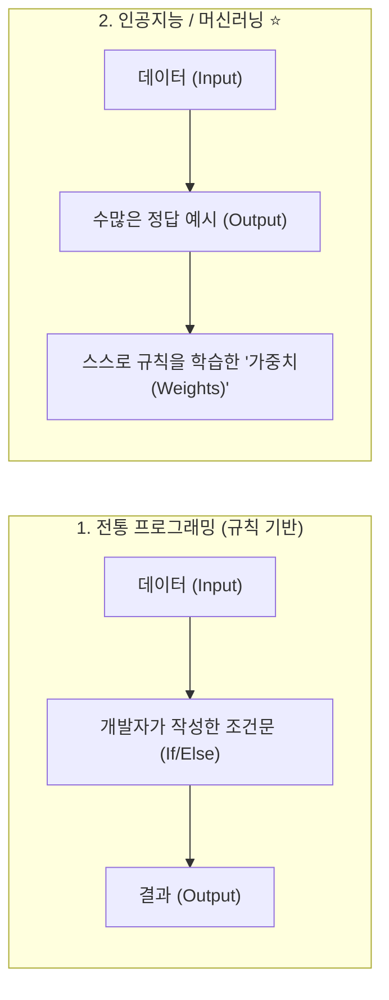
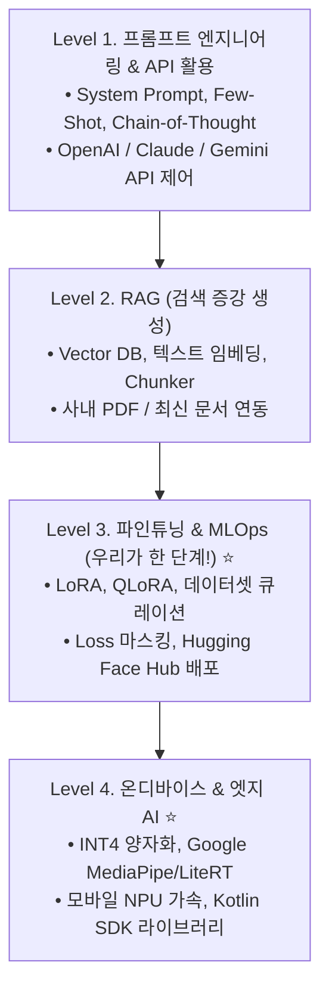

# 🚀 [04] AI 입문자(Level 0)를 위한 AI 엔지니어 성장 로드맵 & 멘탈 모델

전통적인 소프트웨어 개발(Android/Web/Server)과 AI 엔지니어링의 근본적인 차이점과, 입문자가 유능한 AI 엔지니어로 성장하기 위한 4단계 기술 트리입니다.

---

## 1. 생각의 틀(Mental Model) 바꾸기: 규칙 코딩 vs 머신러닝

| 구분 | 전통 소프트웨어 개발 (Android/Web 등) | AI / 머신러닝 엔지니어링 |
| :--- | :--- | :--- |
| **작동 원리** | 100% 확정적 (Deterministic) | **확률적 (Probabilistic)** |
| **에러의 원인** | 코드 버그, 문법 오류, 로직 실수 | **데이터 품질 부족, 가중치 오차, 모호한 프롬프트** |
| **결과 예측** | 항상 똑같은 입력 ➡️ 똑같은 출력 | Temperature(온도)에 따라 매번 조금씩 다른 결과 |
| **개발자의 역할**| "어떻게 계산할지 알고리즘을 직접 짠다" | **"좋은 데이터를 먹이고, 모델이 스스로 배우게 판을 짠다"** |

---

## 2. AI 엔지니어링 4대 기술 레벨 로드맵

AI 개발자로 성장하려면 아래 4단계를 차례대로 정복하는 것이 가장 빠르고 확실합니다:

---

## 3. 추천 무료 학습 리소스 (세계 최고 강의 모음)

1. **Hugging Face NLP Course (무료)**: [https://huggingface.co/learn/nlp-course](https://huggingface.co/learn/nlp-course)
   * 전 세계 AI 개발자들의 필독서로, 토크나이저부터 모델 학습까지 가장 쉽게 설명합니다.
2. **DeepLearning.AI (Andrew Ng 교수 무료 단기 코스)**: [https://www.deeplearning.ai/short-courses/](https://www.deeplearning.ai/short-courses/)
   * 1시간 내외의 짧고 강렬한 실무 강의 (LoRA 파인튜닝, 프롬프트 엔지니어링 등).
3. **Google AI Edge 공식 가이드**: [https://ai.google.dev/edge](https://ai.google.dev/edge)
   * 안드로이드 온디바이스 AI 및 MediaPipe 최신 레퍼런스.
