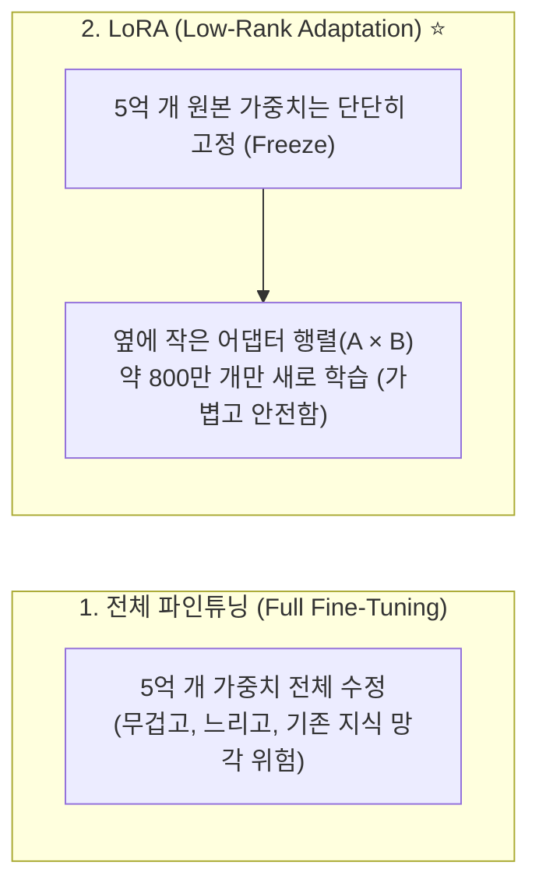

# 🧠 [05] 파인튜닝(Fine-Tuning)과 LoRA 완벽 이해하기

AI 모델을 내 입맛에 맞게 전문적으로 학습시키는 원리와 LoRA(Low-Rank Adaptation) 기술에 대한 실전 가이드입니다.

---

## 1. 사전학습(Pre-training) vs 파인튜닝(Fine-tuning)

* **사전학습 (Pre-training)**:
  * 인터넷의 수조 개 문장을 읽고 한국어 문법, 영어 단어, 일반 상식을 배우는 "초중고 의무교육" 과정입니다.
  * 막대한 비용(수십~수백억 원)과 수천 대의 H100 GPU가 필요하며 빅테크 기업이 만듭니다.
* **파인튜닝 (Fine-tuning)**:
  * 이미 말을 잘하는 베이스 모델에게 **"너는 이제 블로그 글을 읽고 4지선다 퀴즈 JSON을 뽑아내는 전문가가 되어라"** 하고 특정 직업 교육(전공 교육)을 시키는 과정입니다.
  * 개인 맥북(M4 Pro)으로도 10~20분 만에 거뜬히 수행할 수 있습니다.

---

## 2. 왜 전체 파인튜닝 대신 LoRA를 쓰는가?

기존의 전체 파인튜닝(Full Fine-Tuning)은 5억 개의 뇌세포 전체를 수정하므로 다음과 같은 치명적 단점이 있습니다:
1. **메모리 폭발**: 컴퓨터 VRAM이 엄청나게 많이 필요함
2. **파국적 망각 (Catastrophic Forgetting)**: 퀴즈 형식을 배우다가 기존 한국어 독해 능력을 까먹어버림
3. **용량 부담**: 체크포인트마다 1GB가 넘는 원본 모델 파일 전체를 새로 저장해야 함

---

## 3. LoRA의 핵심 하이퍼파라미터 이해하기

파인튜닝 코드(`train_lora.py`)에 등장하는 중요한 설정값들의 의미입니다:

### ① Rank ($r$)
* **의미**: 새로 붙인 LoRA 어댑터 뇌세포의 "용량/두께"입니다.
* $r=8$ (가벼움) ➡️ $r=16$ (표준) ➡️ $r=32$ (고용량, 복잡한 논리/다중 퀴즈 학습에 적합)

### ② Alpha ($\alpha$)
* **의미**: 원본 모델에 LoRA 어댑터의 영향력을 얼마나 강하게 반영할 것인지 결정하는 "스케일링 배율"입니다.
* **업계 공식**: 보통 $Alpha = 2 \times r$ (예: $r=16$이면 $\alpha=32$, $r=32$이면 $\alpha=64$)로 설정합니다.

---

## 4. 학습 관련 필수 용어들

* **손실도 (Loss)**:
  * AI가 예측한 값과 실제 정답 사이의 "오차 점수"입니다. 학습이 잘 진행될수록 `2.0` ➡️ `1.0` ➡️ `0.4` 이하로 떨어집니다.
* **에포크 (Epoch)**:
  * 준비한 학습 데이터를 "처음부터 끝까지 몇 번 반복해서 공부했는가"를 뜻합니다. (3 Epoch = 3회독)
* **배치 사이즈 (Batch Size)**:
  * GPU가 한 번에 묶어서 계산하는 문제의 개수입니다.
* **학습률 (Learning Rate)**:
  * 가중치를 수정할 때의 "보폭 크기"입니다. (너무 크면 튕겨 나가고, 너무 작으면 세월아 네월아 공부함. 보통 `2e-4`~`3e-4` 사용)

---

## 5. Response-Only Loss 마스킹이란? (고급 팁 ⭐)

* 모델에게 `[본문 질문] ➡️ [정답 JSON 퀴즈]`를 가르칠 때, **본문 질문 부분은 Loss 계산에서 제외(Label = -100)하고 오직 정답 JSON 출력 부분에만 오차를 계산**하는 고급 기법입니다.
* 이렇게 하면 모델이 본문을 불필요하게 외우지 않고, **오직 정답 퀴즈를 올바른 문법으로 출력하는 데에만 100% 학습 에너지를 집중**하게 됩니다.
