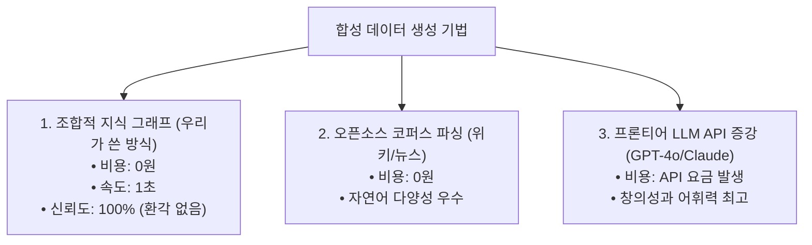

# 📊 [06] 데이터 엔지니어링과 합성 데이터(Synthetic Data)의 원리

"데이터의 품질과 양이 AI의 성능을 결정한다 (Garbage In, Garbage Out)"라는 대원칙과 합성 데이터 제작 기법에 대한 가이드입니다.

---

## 1. Instruction-Response 데이터셋 구조

언어 모델(LLM)을 특정 작업에 맞게 파인튜닝할 때는 주로 **JSON Lines (`.jsonl`)** 포맷을 사용합니다:

```json
{
  "prompt": "<|im_start|>system\n당신은 블로그 퀴즈 생성 AI입니다.<|im_end|>\n<|im_start|>user\n다음 글을 읽고 퀴즈를 만드세요:\n\n[블로그 본문]<|im_end|>\n<|im_start|>assistant\n",
  "response": "[\n  {\n    \"question\": \"코루틴의 특징은?\",\n    \"options\": [\"스레드 비차단\", \"무한 스레드 생성\", \"싱글스레드 전용\", \"GC 미사용\"],\n    \"answer_index\": 0,\n    \"explanation\": \"코루틴은 스레드를 블로킹하지 않고 suspend/resume합니다.\"\n  }\n]"
}
```

* **System Prompt**: AI의 페르소나와 출력 제약 조건(예: "반드시 JSON 배열로만 답해라")
* **User Prompt**: 사용자가 입력할 실제 블로그 글과 지시어
* **Assistant Response**: AI가 출력해야 하는 완벽한 모범 정답

---

## 2. 합성 데이터(Synthetic Data)를 만드는 3대 기법

사람이 수천 개의 글과 문제를 일일이 손으로 타이핑하는 대신, **컴퓨터 알고리즘이나 고성능 AI를 활용해 대량으로 데이터를 자동 합성해 내는 기술**입니다.



---

## 3. 정교한 4지선다 퀴즈를 위한 킬러 오답(Hard Negative) 설계법

AI가 퀴즈를 잘 내게 하려면 **오답 보기(Distractor)**의 품질이 매우 중요합니다.

* **❌ 나쁜 오답 (Easy Negative)**:
  * 문제: "Kotlin Coroutine에서 I/O에 최적화된 디스패처는?"
  * 보기: `Dispatchers.IO`, `사과`, `지하철`, `바나나` ➡️ 너무 쉬워서 모델이 문맥을 공부하지 않습니다.
* **✅ 좋은 오답 (Hard Negative)**:
  * 보기: `Dispatchers.IO` (정답), `Dispatchers.Default`, `Dispatchers.Main`, `Dispatchers.Unconfined`
  * ➡️ 같은 기술 생태계 안에서 실제로 존재하는 용어들을 배치하여, 모델이 진짜 문맥의 차이를 구별하도록 훈련시킵니다.
