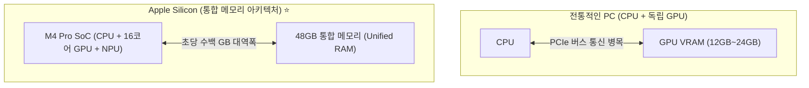

# 🍎 [07] Apple Silicon Mac(M1~M4)에서 AI 학습/파인튜닝 실무 가이드

NVIDIA GPU(CUDA) 없이도 **Apple Silicon Mac(M1/M2/M3/M4)에서 AI 모델을 효율적으로 학습시키고 파인튜닝하는 실전 엔지니어링 가이드**입니다.

---

## 1. 왜 Mac(Apple Silicon)에서 AI 학습이 잘 돌아갈까?

과거에는 AI 학습을 하려면 무조건 수백만 원짜리 NVIDIA 그래픽카드가 필수였습니다. 하지만 Apple Silicon Mac에서는 독보적인 하드웨어 아키텍처 덕분에 로컬 AI 학습이 매우 쾌적합니다.



1. **통합 메모리(Unified Memory)**:
   * 일반 PC는 CPU RAM과 GPU VRAM이 분리되어 있어 PCIe 병목이 발생합니다.
   * Mac은 **48GB 메모리 전체를 CPU와 GPU가 100% 공유**합니다. 10GB~20GB가 넘는 거대 모델도 GPU VRAM 부족(OOM) 없이 한 번에 올려서 학습할 수 있습니다.
2. **Metal Performance Shaders (MPS)**:
   * Apple이 직접 개발한 GPU 가속 프레임워크로, PyTorch 코드에서 `device = "mps"` 한 줄로 Apple GPU를 100% 활용합니다.

---

## 2. Mac AI 개발 프레임워크 3대장 비교

| 프레임워크 | 설명 | 장점 | 단점 |
| :--- | :--- | :--- | :--- |
| **PyTorch (MPS)** ⭐ *(우리가 쓴 방식)* | 글로벌 표준 딥러닝 프레임워크의 Apple Silicon 가속 버전 | • Hugging Face 생태계 100% 호환<br/>• 코드 수정 없이 즉시 사용 가능 | Apple 특화 전용 최적화보다는 약간 느릴 수 있음 |
| **Apple MLX** | 애플 공식 머신러닝 연구팀이 Mac 전용으로 만든 차세대 프레임워크 | • M 시리즈 칩에서 가장 빠른 초고속 학습/추론<br/>• 메모리 효율 극대화 | PyTorch 대비 커뮤니티/라이브러리 생태계가 작음 |
| **llama.cpp** | C/C++ 기반의 초경량 CPU/Metal 추론/양자화 엔진 | • GGUF 포맷을 통한 극단적인 경량화 추론 | 학습/파인튜닝보다는 주로 배포 및 추론에 특화 |

---

## 3. Mac에서 PyTorch 파인튜닝할 때 반드시 알아야 할 실무 팁

### ① 디바이스 설정 코드 (표준 템플릿)
```python
import torch

def get_best_device():
    if torch.backends.mps.is_available():
        print("⚡ Apple Silicon GPU (MPS) 가속 활성화")
        return torch.device("mps")
    return torch.device("cpu")

device = get_best_device()
```

### ② 주의해야 할 MPS 경고 및 세팅
1. **`pin_memory=False`**:
   * PyTorch DataLoader에서 `pin_memory=True`는 CUDA 전용 기능입니다. Mac MPS에서는 지원되지 않으므로 경고가 뜨지 않게 `dataloader_pin_memory=False`로 설정합니다.
2. **데이터 타입(dtype)**:
   * Mac M4 Pro에서는 `torch.float32` 또는 `torch.bfloat16`을 사용하는 것이 가장 안정적입니다.
3. **패키지 관리자**:
   * Mac에서는 Homebrew 시스템 파이썬을 오염시키지 않도록 **`uv`**를 사용하여 `uv venv` 가상환경을 구성하고 패키지를 설치하는 것이 가장 빠르고 안전합니다.
