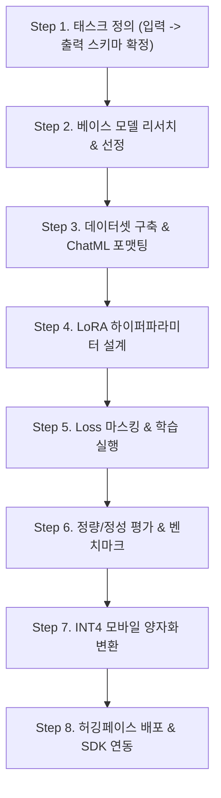

# 🛠️ [08] 실전 파인튜닝(Fine-Tuning) A to Z 단계별 플레이북

아이디어 구상부터 최종 배포까지 **실제 현업에서 AI 모델을 파인튜닝하는 8단계 표준 엔지니어링 프로세스**입니다.

---

## 🎯 전체 파인튜닝 파이프라인 (8 Steps)

---

### Step 1: 태스크 정의 (Task Specification)
* **질문**: AI가 정확히 어떤 입력을 받아 어떤 출력을 내야 하는가?
* **실무 팁**: 출력을 자유 서술형 텍스트로 두지 말고, **JSON 스키마나 엄격한 구분자(Delimiter)**를 정의해야 앱이나 시스템에서 파싱하기 쉽습니다.

---

### Step 2: 베이스 모델 선정 (Base Model Selection)
* 허깅페이스 Hub에서 도메인에 맞는 모델을 찾습니다.
* **한국어 태스크**: `Qwen2.5` 시리즈 (한국어 토크나이저 어휘 수가 많고 압도적인 한국어 성능)
* **영어/글로벌 초경량**: `SmolLM2`, `Llama-3.2`

---

### Step 3: 데이터셋 엔지니어링 (Dataset Engineering)
* 최소 **500 ~ 1,000개 이상**의 고품질 Instruction-Response 쌍을 준비합니다.
* 모델의 기본 채팅 템플릿(ChatML: `<|im_start|>system...<|im_start|>user...<|im_start|>assistant...`)을 철저히 준수합니다.

---

### Step 4: LoRA 하이퍼파라미터 설계
* **Rank ($r$)**: `16` ~ `32` (복잡한 JSON 생성 시 32 권장)
* **Alpha ($\alpha$)**: `2 * r` (예: $r=32$ ➡️ $\alpha=64$)
* **Target Modules**: Attention(`q, k, v, o`) + FeedForward(`gate, up, down`)
* **Learning Rate**: `2e-4` ~ `3e-4` with Cosine Scheduler

---

### Step 5: Loss 마스킹 및 학습 실행
* **핵심**: 사용자의 긴 질문이나 본문 텍스트는 Label을 `-100`으로 마스킹하여 Loss 계산에서 제외하고, **오직 어시스턴트의 정답 출력에만 Loss를 계산**하도록 데이터 콜레이터를 작성합니다.

---

### Step 6: 평가 및 검증 (Evaluation)
* 학습에 쓰이지 않은 검증 데이터셋(Validation Set)에 대해 Loss가 안정적으로 수렴하는지 확인합니다.
* 실제 엣지 케이스(매우 긴 글, 특수문자가 많은 글 등)를 넣고 JSON 파싱 성공률을 측정합니다.

---

### Step 7: 모바일 양자화 및 포맷 변환
* PyTorch 가중치(`.safetensors`)를 **INT4 양자화**하여 모바일 전용 포맷(`.tflite` 또는 `.task`)으로 변환합니다.
* 파일 크기가 300MB~400MB 수준으로 줄어들었는지 확인합니다.

---

### Step 8: 배포 및 오픈소스 릴리즈
* **Hugging Face**: 가중치 및 Model Card(`README.md`) 업로드
* **GitHub & JitPack**: 안드로이드 Kotlin 라이브러리(`AAR`) 배포 및 다른 개발자가 쓸 수 있도록 Quickstart 문서 작성
