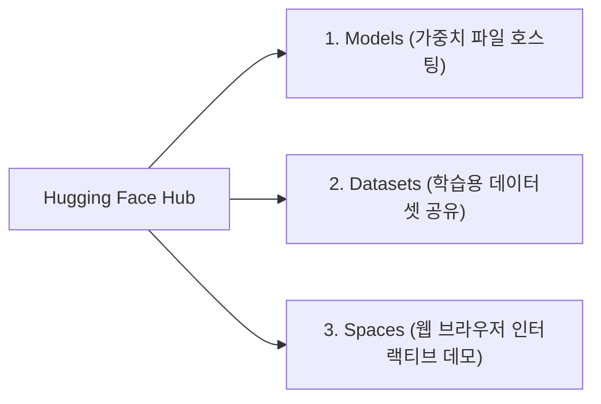

# 🤗 [09] 허깅페이스(Hugging Face) 완벽 가이드

허깅페이스의 개념, 구조, 그리고 공식 `hf` CLI를 활용한 배포 실무 가이드입니다.

---

## 1. 허깅페이스란 무엇인가?

* **정의**: AI 개발자들의 GitHub입니다.
* 전 세계 개발자들과 구글, 메타, 알리바바, 미스트랄 같은 빅테크 기업들이 만든 최신 AI 모델 가중치와 데이터셋을 공유하는 글로벌 표준 플랫폼입니다.



---

## 2. Model Card (README.md)의 중요성

* 허깅페이스에 모델을 올릴 때 가장 중요한 파일이 루트의 `README.md`인 **Model Card**입니다.
* 전 세계 개발자들은 이 Model Card를 보고:
  1. 어떤 베이스 모델로 만들어졌는지 (`base_model`)
  2. 어떤 라이선스인지 (`license`)
  3. 어떤 목적으로 사용해야 하는지 (`tags`, `pipeline_tag`)
  4. 파이썬이나 안드로이드에서 어떻게 사용하는지 (코드 예시)
  를 확인하고 모델을 다운로드합니다.

---

## 3. 공식 `hf` CLI 주요 명령어 모음

맥북 터미널에서 자주 사용하는 허깅페이스 CLI 명령어들입니다:

```bash
# 1. 로그인 (토큰 입력 후 로컬에 인증 저장)
hf auth login

# 2. 현재 로그인된 사용자 정보 확인
hf auth whoami

# 3. 모델 레포지토리 목록 검색
hf models ls --search "qwen2.5"

# 4. 내 로컬 폴더의 모델 파일을 허깅페이스에 업로드
hf upload username/my-model-name ./local_folder .

# 5. 허깅페이스에 올라간 모델을 로컬로 다운로드
hf download username/my-model-name
```

---

## 4. 토큰 발급 및 보안 주의사항

* Hugging Face의 **Settings ➡️ Access Tokens** 메뉴에서 토큰을 생성합니다.
* 모델을 업로드하려면 반드시 **`Write`** 권한이 있는 토큰을 발급받아야 합니다.
* ⚠️ **보안 경고**: 토큰(`hf_...`)을 깃허브 공개 레포지토리 코드에 직접 하드코딩하여 커밋하면 안 되며, 환경 변수(`export HF_TOKEN="hf_..."`) 또는 `hf auth login`을 통해 로컬에만 안전하게 저장해야 합니다.
