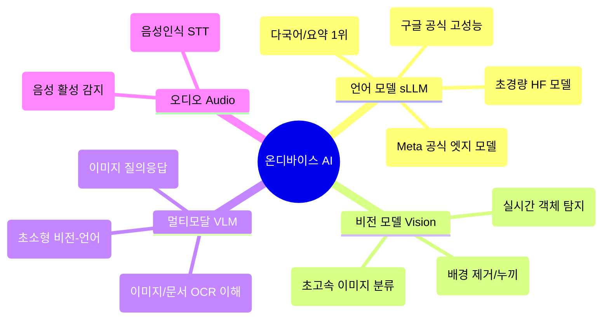

# 📱 [10] 온디바이스 AI 모델의 종류와 선정 실무 기준

실제 모바일/임베디드 제품을 만들 때 **어떤 AI 모델을 선택하고, 어떤 포맷으로 변환해야 하는지**에 대한 실무 가이드입니다.

---

## 1. 온디바이스 AI 모델의 주요 카테고리

---

## 2. 모바일 기기 RAM 스펙별 모델 선정 공식

스마트폰의 RAM 용량에 맞춰 적절한 모델을 선정하지 않으면 앱이 강제 종료(OOM Crash)됩니다.

| 기기 등급 | 대표 스마트폰 | 스마트폰 RAM | 추천 온디바이스 sLLM | 4-bit 모델 용량 |
| :--- | :--- | :---: | :--- | :---: |
| **보급형 / 구형** | Galaxy A15, A24 등 | **4GB ~ 6GB** | **Qwen2.5-0.5B** ⭐ / SmolLM2-360M | **~350 MB** |
| **중급형 / 일반** | Galaxy A54, iPhone 14/15 | **6GB ~ 8GB** | **Llama 3.2-1B** / Qwen2.5-1.5B | **~700 MB ~ 950 MB** |
| **플래그십** | Galaxy S24/S25 Ultra, Pixel 9 Pro | **12GB ~ 16GB** | **Gemma 2 (2B)** / Llama 3.2 (3B) / Phi-4-mini | **~1.3 GB ~ 2.4 GB** |

---

## 3. 온디바이스 배포 포맷 4대장

학습된 모델(`.safetensors`)을 모바일에 올리려면 런타임에 맞는 포맷으로 변환(Export)해야 합니다:

1. **`.task` / `.tflite` (Google LiteRT & MediaPipe)** ⭐ *(우리가 쓴 방식)*
   * **적합한 플랫폼**: 안드로이드(Android)
   * **특징**: 구글 공식 런타임으로 안드로이드 OS의 GPU/NPU 가속과 가장 안정적으로 연동됩니다.
2. **`.gguf` (llama.cpp)**
   * **적합한 플랫폼**: 크로스 플랫폼 (iOS, Android, macOS, Linux, Windows)
   * **특징**: C++ 네이티브로 빌드되어 가볍고, 다양한 양자화 옵션(Q4_K_M, Q8_0 등)을 지원합니다.
3. **`.onnx` (ONNX Runtime Mobile)**
   * **적합한 플랫폼**: Microsoft / Windows / Android / iOS
   * **특징**: 전통적인 머신러닝/딥러닝 모델부터 LLM까지 가장 넓은 호환성을 자랑합니다.
4. **`.pte` (Meta ExecuTorch)**
   * **적합한 플랫폼**: Meta Llama 전용 모바일 런타임
   * **특징**: PyTorch 모델을 모바일 기기(iOS, Android)에서 다이렉트로 돌릴 수 있게 해주는 Meta의 차세대 프레임워크입니다.
